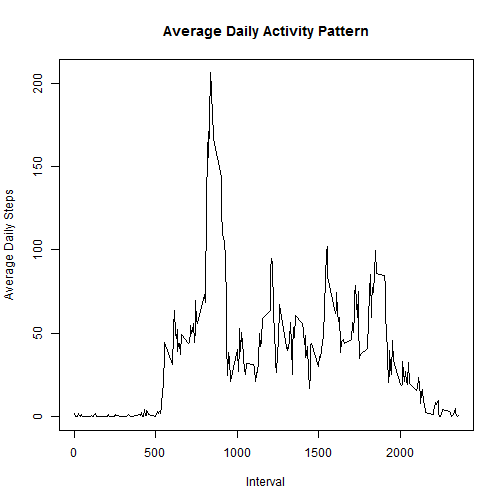
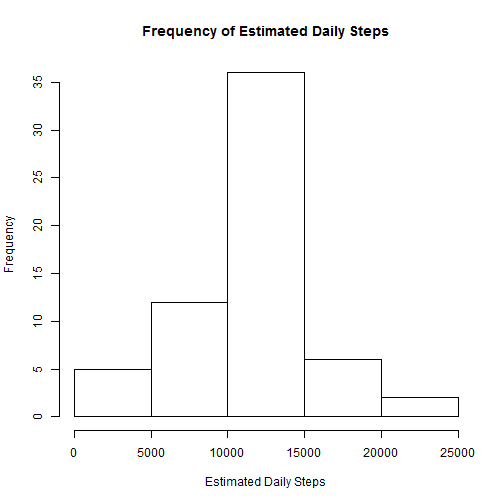
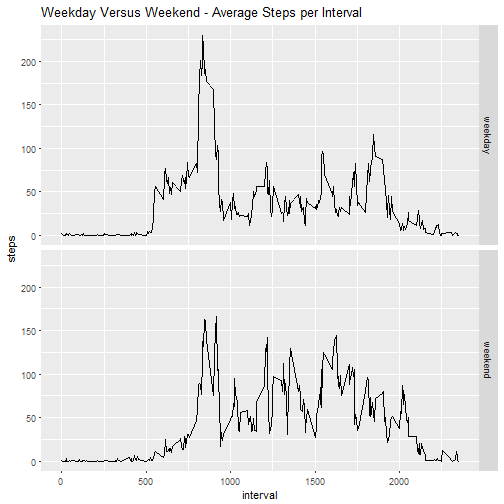

PA1_template
==================================================


### Loading and Preprocessing Data

Download Data

```r
if(!file.exists("activity.csv")) {
        fileUrl <- "https://d396qusza40orc.cloudfront.net/repdata%2Fdata%2Factivity.zip"
        download.file(fileUrl, destfile="C:/Users/yrafael/Desktop/Data Science Course/Course Code/repdata%2Fdata%2Factivity.zip", mode = "wb")
        unzip("repdata%2Fdata%2Factivity.zip")
}
```

Read data

```r
data <- read.csv("activity.csv")
```

### What is mean total number of steps taken per day?

Calculate the total number of steps taken per day.

```r
completedata <- subset(data, complete.cases(data) == TRUE)
stepsbydate <- split(completedata$steps, completedata$date, drop = TRUE)
sumstepsbydate <- sapply(stepsbydate, sum)
```

Histogram of total number of steps taken each day.

```r
hist(sumstepsbydate, main = "Frequency of Daily Steps", xlab = "Daily Steps")
```


Mean and Median number of steps taken each day.

```r
mean(sumstepsbydate)
```

```
## [1] 10766.19
```

```r
median(sumstepsbydate)
```

```
## [1] 10765
```


### What is the average daily activity pattern?

Time series plot of average nubmer of steps taken in each 5-minute interval.

```r
stepsbyinterval <- split(completedata$steps, completedata$interval, drop = TRUE)
averagestepsbyinterval <- sapply(stepsbyinterval, mean)
plot(names(averagestepsbyinterval), averagestepsbyinterval, type = "l", xlab = "Interval", ylab = "Average Daily Steps", main = "Average Daily Activity Pattern")
```



Interval of max number of steps taken.

```r
names(which.max(averagestepsbyinterval))
```

```
## [1] "835"
```

### Imputing missing values

Calculate total missing Values.

```r
sum(is.na(data$steps))
```

```
## [1] 2304
```

Filling Missing Values with average daily steps by interval. Create a new data set based on that strategy.

```r
estimateddata <- data
for (i in 1:nrow(estimateddata)) {
        if(is.na(estimateddata$steps[i]) == TRUE) {
        estimateddata$steps[i] <- averagestepsbyinterval[as.character(estimateddata[i,3])]
        }
}
estimatedstepsbydate <- split(estimateddata$steps, estimateddata$date, drop = TRUE)
estimatedsumstepsbydate <- sapply(estimatedstepsbydate, sum)
```

Make a histogram of the total number of steps taken each day with inputted data.

```r
hist(estimatedsumstepsbydate, main = "Frequency of Estimated Daily Steps", xlab = "Estimated Daily Steps")
```



Mean and Median number of steps taken each day.The mean remained the same and the median increased slightly.

```r
mean(estimatedsumstepsbydate)
```

```
## [1] 10766.19
```

```r
median(estimatedsumstepsbydate)
```

```
## [1] 10766.19
```


### Are there differences in activity patterns between weekdays and weekends?

Create a new factor variable in the data set with two levels - "weekday" and "weekend"

```r
daytypedata <- estimateddata
daytypedata$daytype <- "weekday"
for (i in 1:nrow(daytypedata)) {
        if(weekdays(as.Date(daytypedata[i,2])) == "Saturday" | weekdays(as.Date(daytypedata[i,2])) == "Sunday") {
        daytypedata[i,4] <- "weekend"
        }
}
daytypedata$daytype <- as.factor(daytypedata$daytype)
```

Make a panel plot containing a time series plot of the 5-minute interval x-axis and the average number of steps taken averaged across across all weekdays or weekend days.


```r
averagesteps_bydaytype_byinterval <- aggregate(steps ~ interval + daytype, daytypedata, mean)
library(ggplot2)
g <- ggplot(averagesteps_bydaytype_byinterval, aes(interval, steps))
g + geom_line() + facet_grid(daytype ~ .) + labs(title = "Weekday Versus Weekend - Average Steps per Interval")
```




